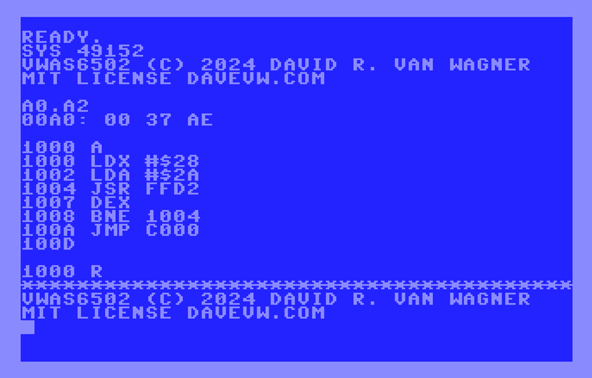
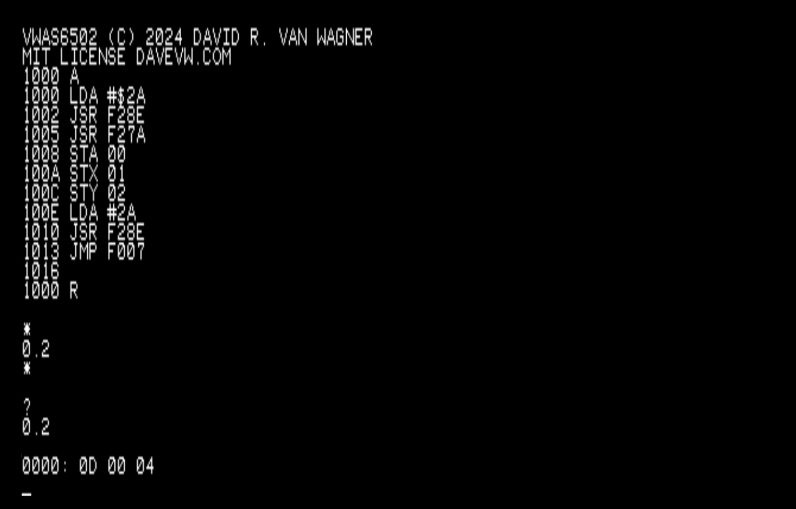

# vwas6502

Monitor with mini-assembler and disassembler

**Current status**: working on two systems, designed to be ported to other 6502 systems, both commercial and hobbyist

## (1) C64 with screen editor (or without)

## (2) minimal 6502 + MC6850 UART system

## Display
``1000`` display memory byte contents  
``1000.100F`` display memory range contents  
``1000.`` display screenfull of memory  
``.`` display next screenfull of memory

## Modify
``1000: 01 02 03`` modify memory contents

## Run
``1000 R`` run program (JMP)

## Assemble
``1000 A`` assemble at address

## Disassemble
``1000 D`` disassemble screenfull  
``D`` disassemble next screenfull

## Notes

* Original code!  Not a port, nothing borrowed except look and feel.
* This monitor is borrowing the look and feel of [WozMon](https://github.com/davervw/wozmon_cbm) (of Apple 1 fame).  Commands are similar, but not exact behavior and syntax as this is brand new code, and a different command parser.
* Goal is to port this monitor for use with my minimal 6502 emulated environment [(Twitter/X announcement)](https://x.com/DaveRVW/status/1787386286552268934) delivered with the [c-simple-emu6502-cbm terminal version](https://github.com/davervw/c-simple-emu6502-cbm) and [(unified) graphical version](https://github.com/davervw/c-simple-emu6502-cbm/tree/unified).
* With a tiny bit of work, this monitor could work on virtually any 6502 8-bit computer, or 6502 single board computer, that supports character input/output and a screen or terminal display

## Building

* Requires [ACME](https://sourceforge.net/projects/acme-crossass/), [VICE](https://vice-emu.sourceforge.io/), and a shell (e.g. bash) to build and run (see build.sh)
* Development works across Windows, Linux, and Mac

## Download

* [D64](vwas6502.d64) drive image or [PRG](vwas6502.prg) file can be transported to a real C64 for use
* The [BIN](vwas6502.bin) firmware file is for use with [c-simple-emu6502-cbm](https://github.com/davervw/c-simple-emu6502-cbm), both the main branch (text console terminal), and unified branch (LCD and Windows graphics)

## More Links

* [Blog entry](https://techwithdave.davevw.com/2024/07/mini-assembler-with-disassembler.html) for mini-assembler and disassembler, [Twitter/X announcement](https://x.com/DaveRVW/status/1811912606825005540)
* Archived link to [disassembler-only](archive/Disassembler.md) stage of project
